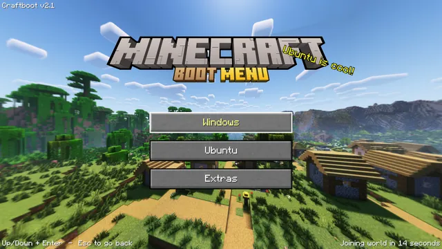
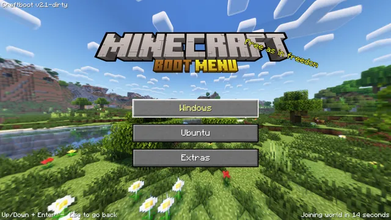
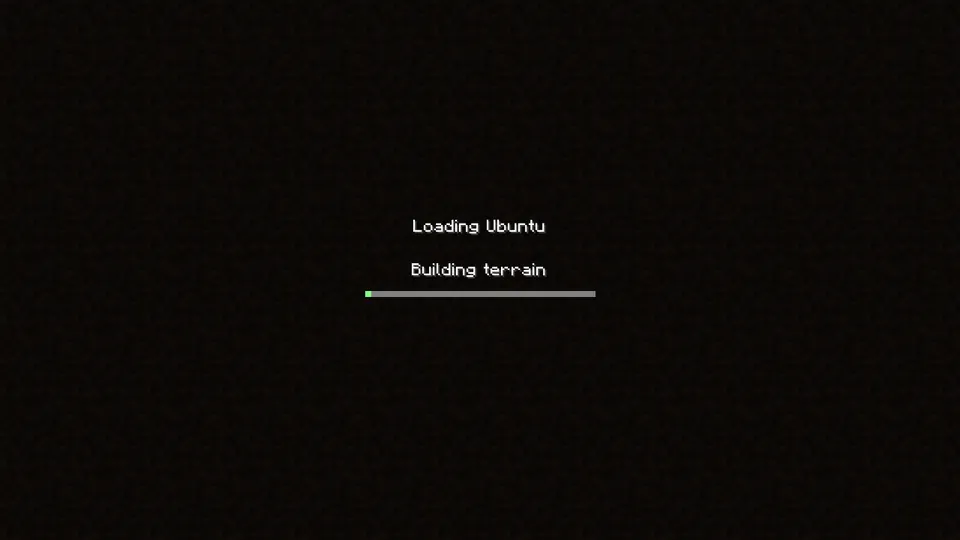

# craftboot


A Minecraft-style **graphical boot menu** that runs as its own signed **UEFI
application**, shows a rotating 360° Minecraft title panorama, and hands off to
**Windows** or **Ubuntu** when you pick a "world".

It replaces the *interactive* role of GRUB with an actual program: a rotating
perspective panorama (a random Minecraft version each boot, the logo auto-matching
the world), grainy Minecraft buttons, pulsing splash text, a "Building terrain"
loading animation, and a 15-second auto-boot countdown.

> **Status: v3.0 is installed and running on real hardware**
> (ASUS ROG G713PI, Ubuntu, **Secure Boot ON**) — `craftboot.efi` is a
> freestanding PE32+ UEFI application that the firmware loads directly as the
> default boot entry, renders at **~100 fps** at 1920×1080 across all CPU cores,
> and hands off to the chosen OS by **chainloading** its loader in the same boot
> — **zero reboot**, firmware state untouched.
>
> v1/v2 were a Linux program running as `/init` (PID 1) inside a signed
> initramfs. That path was **retired in v3.0**; see
> [How v3 differs from the v1/v2 initramfs](#how-v3-differs-from-the-v1v2-initramfs)
> and [CHANGELOG.md](CHANGELOG.md).
> Grew out of customizing the [minegrub](https://github.com/Lxtharia/minegrub-theme)
> GRUB theme; it is now a standalone project, rewritten from Python/pygame to
> plain C.

---

## Demo

**Main menu** — navigation and the *Extras* submenu, over a rotating 360° panorama:



**A random Minecraft version each boot** — the logo auto-matches the world:



**Loading screen** shown during the handoff to the selected OS:



> These captures predate the current camera settings (see
> [Panorama tunables](#panorama-tunables)), so the framing is tighter than what
> a current build renders.

---

## Table of contents

- [Demo](#demo)
- [Why a program instead of a GRUB theme](#why-a-program-instead-of-a-grub-theme)
- [How it works](#how-it-works)
- [How v3 differs from the v1/v2 initramfs](#how-v3-differs-from-the-v1v2-initramfs)
- [Repository layout](#repository-layout)
- [Prerequisites](#prerequisites)
- [Install](#install)
- [Development loop (QEMU)](#development-loop-qemu)
- [Testing & CI](#testing--ci)
- [Versioning](#versioning)
- [Recovery & fallback](#recovery--fallback)
- [Contributing: code](#contributing-code)
- [Contributing: new panoramas](#contributing-new-panoramas)
- [Contributing: new logos](#contributing-new-logos)
- [Panorama tunables](#panorama-tunables)
- [Porting to another distro](#porting-to-another-distro)
- [Credits & citations](#credits--citations)
- [License & trademark](#license--trademark)

---

## Why a program instead of a GRUB theme

GRUB (and every other boot menu) can only draw a *static* image — no panning
background, no pulsing splash, no animation. To get the real animated Minecraft
title screen with selectable OS entries, the menu has to be an actual program.
So craftboot **is** the boot menu: a UEFI application the firmware runs directly,
which then launches the OS you pick.

---

## How it works

### The boot chain (Secure Boot compatible)

```
UEFI firmware
  └─ EFI/craftbootv3/shimx64.efi      (Microsoft-signed shim, copied from Ubuntu)
       └─ EFI/craftbootv3/grubx64.efi (craftboot.efi under shim's second-stage
                                        name, signed with your own MOK key)
            └─ the menu, then chainload the chosen loader (LoadImage/StartImage)
```

- `shim` is Microsoft-signed, so the firmware trusts it; it verifies
  `craftboot.efi` against your enrolled **MOK** key. Secure Boot stays **on**,
  and Windows/BitLocker are untouched.
- craftboot runs **before `ExitBootServices`**, while UEFI boot services (and
  the firmware's own drivers) are still live.
- Two things are required for shim 15.8 to accept the image, both handled by the
  build: a valid **`.sbat`** section placed *inside* `SizeOfImage`
  ([`src/efi/sbat.c`](src/efi/sbat.c)), and **no trailing COFF symbol table**
  past the last PE section (`objcopy --strip-all`). CI asserts both.

### Rendering — no GPU, no OpenGL, no libc

There is no Mesa/GL stack in firmware, so the app renders in software onto the
**GOP** (Graphics Output Protocol) framebuffer. Two findings shaped this:

- **Present via `Blt`, not direct writes.** The GOP framebuffer is mapped
  *uncached* on the real AMD GPU (~22 MB/s), which made a full-screen frame take
  **372 ms**. Compositing into a cached RAM back-buffer and handing it to the
  firmware's own `Blt(BufferToVideo)` fast path drops the present to **~6 ms**.
- **SIMD must be switched on first.** Firmware leaves `CR4.OSXSAVE` clear, so
  AVX2 instructions `#UD` on entry. `simd_enable()` sets
  `CR4.OSFXSR|OSXMMEXCPT|OSXSAVE` and `XCR0 = x87|SSE|AVX` before any SIMD runs
  — per core.

The panorama is spread across **all CPU cores** via the EFI **MP Services**
protocol (`StartupAllAPs` with work-stealing row slices, each AP enabling SIMD
on itself). That took the render from 12 ms to ~5 ms on real hardware. Note that
this is *slower* under QEMU, where virtualized IPIs cost far more than the work
they distribute — it's a real-hardware win only.

Everything is plain **CPU SIMD**: blits, 9-slice buttons, bitmap-font text, and
the panorama are hand-written fixed-point C with an AVX2 gather fast path
([`src/core/render.c`](src/core/render.c)). `make bench` and `make diff-pano`
(byte-identical scalar-vs-AVX2 differential) cover it.

There is no libc: [`src/efi/mini_libc.c`](src/efi/mini_libc.c) supplies the
allocator, mem/str ops, a mini `snprintf`, and range-reduced trig.

### The panorama

Backgrounds are Minecraft's real title **cubemaps**, fetched from Mojang's own
version manifest by [`tools/fetch_panoramas.py`](tools/fetch_panoramas.py) and
reprojected offline into seamless **equirectangular** JPEGs (4096×2048). At
runtime a per-pixel camera-ray → lat/lon lookup table gathers from the equirect
with **bilinear** interpolation; the yaw advances slowly for a smooth 360°
rotation.

The 1.13+ panoramas come from 1024²-per-face cubemaps and stay sharp. The
1.8–1.12 "classic" panorama only exists at **256² per face**, which at a wide
field of view goes sharp-in-the-centre and smeared at the sides — so that one
theme (and only that one) gets a uniform screen-space blur, making it read as a
deliberate soft look rather than a broken one. See
[Panorama tunables](#panorama-tunables).

### The handoff

The loading screen plays, then control passes to the selected OS **in the same
boot** — no reboot, no `kexec`:

| Target                | Mechanism | |
|-----------------------|-----------|---|
| **Ubuntu**            | `LoadImage`/`StartImage` on `\EFI\ubuntudirect\shimx64.efi` (device-path form) | ✅ seamless, zero reboot |
| **Ubuntu (recovery)** | same, on a recovery UKI in *Extras* | ✅ seamless |
| **Memtest86+**        | same, on `\EFI\memtest\mtx64.efi` | ✅ seamless |
| **Windows**           | `BootNext` = "Windows Boot Manager" + `ResetSystem` | reboots on purpose (see below) |
| **UEFI**              | `OsIndications` BOOT_TO_FW_UI bit + `ResetSystem` | reboot into firmware setup |

The chainload uses the **device-path** form of `LoadImage` rather than the
buffer form: shim locates its own next stage relative to where it was loaded
from, and an image loaded from a memory buffer has no device path to search.

**Windows deliberately uses `BootNext` instead of chainloading.** Chainloading
`bootmgfw.efi` from a third-party application changes the TPM PCR measurements
Windows expects, which can trigger a **BitLocker recovery prompt**. `BootNext`
lets the firmware launch Windows itself, exactly as if you had picked it in the
UEFI boot menu, so the measurement chain is unchanged.

---

## How v3 differs from the v1/v2 initramfs

v1/v2 shipped craftboot as a statically-linked Linux binary running as `/init`
(PID 1) in a signed initramfs, rendering via DRM/KMS dumb buffers and reading
input from raw evdev. It worked, but the handoff was the problem:

- `kexec`-ing straight into the Ubuntu kernel skipped the firmware's ACPI init
  for the ALC294 speaker amp, leaving it **silently dead** until a cold boot.
- Falling back to `BootNext` + reboot fixed the audio but cost a full firmware
  re-POST on every boot.

Running **before `ExitBootServices`** removes the dilemma entirely: chainloading
the next loader keeps firmware state pristine, so there is nothing to re-POST and
nothing for `kexec` to skip. v3.0 retired the initramfs path, its DRM/evdev and
SDL backends, and the initramfs/UKI build scripts.

---

## Repository layout

```
src/
  core/       render.c/.h (blits, text, panorama+AVX2, fb_blur), assets.c/.h
              (config/image/font loading), menu.c/.h (state machine + scene draw),
              efivar.c/.h (pure firmware-format helpers, host-tested),
              actions.h (the handoff interface), version.h
  platform/   display.h / input.h / plat.h (backend interfaces) + plat_host.c
              (host implementation, used only by the test harnesses)
  efi/        the UEFI application: main.c (efi_main, SIMD enable, arena),
              efi.h (protocol/type defs), mini_libc.c/.h (freestanding allocator,
              mem/str, snprintf, trig), display_efi.c (GOP + Blt present),
              input_efi.c (Simple Text Input), fs.c/.h (Simple File System),
              sys.c/.h (TSC timing, RNG), actions_efi.c (chainload + BootNext +
              OsIndications), plat_efi.c (incl. MP Services multi-core render),
              sbat.c (the .sbat section shim requires)
  vendor/     stb_image.h, jsmn.h (vendored single-header libs)
assets/
  panoramas/        the 15 per-version 360° worlds, JPEG (1.NN[.PP]_name.jpg)
  logos/            one wordmark logo per world (minecraft_<name>.png) + logo_map.json
  fonts/baked/      baked bitmap atlases (png + json metrics) built by tools/bake_font.py
  minecraft.otf, button*.png, dirt.png, splashes.txt
assets_src/         pristine pre-processing panorama sources (not shipped to the ESP)
dist/ubuntu/
  efi-install.sh    sign + install craftboot.efi as a firmware entry (MOK, shim,
                    recovery UKI, memtest); also --promote / --uninstall / --print
  ubuntu-direct.sh  build + sign the direct Ubuntu UKI that craftboot chainloads
tools/
  run-qemu-efi.sh      boot craftboot.efi in QEMU/OVMF (headless + HMP screendump)
  fetch_panoramas.py   Mojang cubemap faces -> equirectangular JPEGs
  build_panorama.py    your own 6 cubemap faces -> equirectangular JPEG
  bake_font.py         minecraft.otf -> baked bitmap font atlases
tests/          unit tests (t.h harness, test_*.c) + bench_pano.c, diff_pano.c,
                fuzz_parse.c, stub_platform.c, efi/chainload_target.c
.github/
  workflows/ci.yml       lint, build+test+bench+diff-pano, sanitizers+fuzz, efi build
  workflows/release.yml  publish craftboot.efi on a version tag
  CODEOWNERS             @vlah02 review required repo-wide
boot_entries.json     the menu structure (entries, types, targets)
Makefile        efi / test / bench / diff-pano / test-asan / fuzz
CHANGELOG.md
```

---

## Prerequisites

Host packages (Ubuntu/Debian names):

```bash
# build the UEFI application (PE32+ cross-compile)
sudo apt install build-essential gcc-mingw-w64-x86-64 binutils-mingw-w64-x86-64

# signing + boot chain
sudo apt install sbsigntool mokutil systemd-ukify

# QEMU testing (dev loop)
sudo apt install qemu-system-x86 ovmf

# asset tools (contributor-only: panoramas, font baking)
sudo apt install python3-pil python3-numpy
```

You also need a machine that boots via **UEFI**, with Ubuntu installed using
**shim** (the standard Secure Boot setup, files under `/boot/efi/EFI/ubuntu/`).

---

## Install

### 1. Clone and check the menu config

```bash
git clone <your-fork-url> craftboot && cd craftboot
```

[`boot_entries.json`](boot_entries.json) defines the menu. The defaults match a
stock Ubuntu + Windows dual-boot; adjust if your paths differ:

- `chainload` entries take an ESP-relative `path` (e.g.
  `\EFI\ubuntudirect\shimx64.efi`).
- `bootnext` entries take a `match` string that must equal the firmware entry's
  description **exactly** as `efibootmgr` prints it (e.g. `Windows Boot Manager`).
  Check with `efibootmgr | grep -i windows`.

### 2. Try it in QEMU first (no risk)

See [Development loop](#development-loop-qemu). Nothing touches your real boot
order yet.

### 3. Install it

```bash
sudo ./dist/ubuntu/efi-install.sh
```

This one script does everything:

1. Creates a MOK key in `/var/lib/craftboot/` if there isn't one, and starts
   enrollment.
2. Builds and signs `craftboot.efi`, installing it as
   `\EFI\craftbootv3\grubx64.efi` next to a copy of Ubuntu's shim.
3. Builds + signs the direct Ubuntu UKI (`\EFI\ubuntudirect\`) that craftboot
   chainloads, plus a recovery UKI and a MOK-signed Memtest86+.
4. Registers the `Craftboot v3` firmware boot entry.
5. Installs a kernel hook (`/etc/kernel/postinst.d/zz-craftboot-v3`) that
   rebuilds and re-signs the UKIs on every kernel update.

If the MOK key was just created, **reboot** and complete enrollment at the blue
**MOK Manager** screen: **Enroll MOK → Continue → Yes →** enter the password you
set, then re-run the script.

> 💡 The MOK Manager password screen uses the pre-boot keyboard driver, which is
> flaky on some laptops (including the ASUS internal N-KEY keyboard) — use an
> **external USB keyboard** and a simple digit password. Verify afterwards:
> `sudo mokutil --test-key /var/lib/craftboot/MOK.der` → "is already enrolled".

The entry is installed **non-default** so you can test it first. Once you're
happy:

```bash
sudo ./dist/ubuntu/efi-install.sh --promote    # make Craftboot v3 first in BootOrder
```

`--promote` is idempotent — re-run it any time the firmware reshuffles the order.

### Uninstall

```bash
sudo ./dist/ubuntu/efi-install.sh --uninstall
# (the MOK key is kept; to un-enroll: sudo mokutil --delete /var/lib/craftboot/MOK.der)
```

---

## Development loop (QEMU)

Build and boot the real EFI application under OVMF:

```bash
make efi
./tools/run-qemu-efi.sh boot            # headless; prints the monitor socket + serial log
./tools/run-qemu-efi.sh screendump /tmp/shot.ppm
./tools/run-qemu-efi.sh sendkey down
./tools/run-qemu-efi.sh stop
```

To watch it live in a window instead, point QEMU at the staged ESP that
`boot` builds (`build/esp-efi`) with `-display gtk`.

Once you're happy, deploy to the real signed entry:

```bash
sudo ./dist/ubuntu/efi-install.sh && sudo reboot
```

> `run-qemu-efi.sh` runs QEMU under `env -i` because a **snap-launched terminal**
> (e.g. VS Code's) leaks `LD_LIBRARY_PATH` and breaks the system QEMU.

---

## Testing & CI

There is no host binary to run — the artifact is the EFI application. The test
harnesses compile the platform-agnostic core for the host so it can be exercised
with tooling that cannot run inside firmware (sanitizers, gdb);
`tests/stub_platform.c` satisfies the display/input hooks the tests never call.

```bash
make test       # unit tests -> "ALL TESTS PASS" (tests/test_*.c, the t.h harness)
make bench      # panorama render benchmark; fails if slower than
                # CRAFTBOOT_BENCH_MAX_MS (default 3.0 ms/frame @ 1920x1080)
make diff-pano  # scalar-vs-AVX2 panorama render, must be byte-identical
make test-asan  # the same cases, rebuilt with -fsanitize=address,undefined
make fuzz       # fuzz-lite of the efivar load-option + boot_entries.json
                # parsers under ASan+UBSan (fixed-seed, deterministic)
make efi        # the shipped UEFI application
```

[GitHub Actions](.github/workflows/ci.yml) runs on every pull request against
`main` (and on push to `main`, as a post-merge guard) as four jobs:

- **lint scripts + config** — every `dist/**/*.sh` + `tools/*.sh` must parse
  under `bash -n`, every `tools/*.py` must byte-compile, and
  `boot_entries.json` must be valid JSON (a syntax error there means a menu that
  won't load, with no console to debug it).
- **build + test** — the core and test harnesses must build warning-free
  (`-Wall -Wextra`; CI greps the build log for `warning:`), then `make test`,
  `make bench` (gated at **8 ms/frame** here — shared runners are slower than
  the target hardware; override with `CRAFTBOOT_BENCH_MAX_MS`), and
  `make diff-pano`.
- **sanitizers + fuzz** — `make test-asan` and `make fuzz`, both built with
  `-fno-sanitize-recover=undefined` so a UBSan trip aborts nonzero and fails the
  job instead of printing a diagnostic and passing.
- **efi app build** — `make efi` must be warning-free and produce a real PE32+
  image, **with a `.sbat` section and no trailing COFF symbol overlay**. Those
  two assertions are not cosmetic: each corresponds to a failure mode that made
  shim refuse to load craftboot during bring-up. The built `craftboot.efi` is
  uploaded as an artifact so a PR build can be tested in QEMU without a local
  mingw toolchain.

The build/test and sanitizer jobs need an **AVX2-capable runner**: the core is
built `-march=x86-64-v3` with no runtime scalar fallback, so CI checks
`/proc/cpuinfo` for `avx2` up front and fails fast rather than segfaulting deep
into a build.

OVMF/QEMU boot is deliberately **not** exercised in CI (flaky there) — it stays
a local gate via `tools/run-qemu-efi.sh`.

`main` is branch-protected: a PR needs green CI and a review from
[@vlah02](.github/CODEOWNERS) before it can merge.

---

## Versioning

`git describe --tags` is the source of truth, injected at build time
(`-DCRAFTBOOT_VERSION_GIT`, see the `Makefile`);
[`src/core/version.h`](src/core/version.h)'s `"v3.0"` is only a fallback for
builds outside the Makefile (IDE indexers, ad-hoc `gcc`). On a tagged commit the
footer reads `Craftboot v3.0  102 fps`; off-tag it shows the raw describe
string, e.g. `Craftboot v3.0-3-gabc1234`.

To cut a release: tag, then rebuild — the version is baked in at compile time,
so existing binaries don't retroactively pick it up.

```bash
git tag v3.1 && make clean && make efi
```

Pushing a `v*` tag triggers [`release.yml`](.github/workflows/release.yml), which
builds and publishes `craftboot.efi`. That published binary is **unsigned** —
Secure Boot needs a per-machine MOK key — so install it with `efi-install.sh`
rather than copying it to the ESP by hand.

See [CHANGELOG.md](CHANGELOG.md) for what shipped in each tag.

---

## Recovery & fallback

craftboot is one firmware entry among several, so there is always a way past it:

- If the `Craftboot v3` entry ever fails, the firmware **falls through** to the
  next entry — or pick **Ubuntu** yourself from the UEFI boot menu (usually F8 on
  ASUS). That entry boots the same signed UKI craftboot chainloads, without
  craftboot in the path.
- Ubuntu's own `\EFI\ubuntu\` shim→GRUB entry is left **installed and untouched**
  as a deeper fallback. Your firmware may re-advertise it automatically; if you
  don't want to see it in the boot menu, mark it inactive rather than deleting
  it (`sudo efibootmgr -b <num> -A`), since `grub-efi-amd64`/`shim-signed`
  package updates recreate the directory anyway.
- **Kernel updates** are handled by `/etc/kernel/postinst.d/zz-craftboot-v3`,
  which rebuilds and re-signs the UKIs. If a rebuild ever fails, boot Ubuntu and
  re-run `sudo ./dist/ubuntu/efi-install.sh`.
- **Extras → Ubuntu (recovery mode)** chainloads a separate recovery UKI, so it
  keeps working even if the normal one is broken.

---

## Contributing: code

```bash
make efi        # the shipped UEFI application -> build/craftboot.efi
make test       # unit tests (tests/, t.h harness) -> "ALL TESTS PASS"
make bench      # panorama render benchmark
make diff-pano  # scalar-vs-AVX2 byte-identical differential test
make test-asan  # sanitizer build
make fuzz       # parser fuzzing
```

Builds are `-Wall -Wextra` clean — treat any new compiler warning as a bug to fix
before sending a PR. Keep `src/core/` platform-agnostic: it must compile both for
the host (tests) and freestanding under mingw, so no libc beyond what
`src/efi/mini_libc.h` provides. Distro-specific boot-chain code goes under
`dist/<distro>/` — see [Porting to another distro](#porting-to-another-distro).

All of the above runs in CI on every PR; run it locally first, since `main` is
branch-protected on green CI.

---

## Contributing: new panoramas

Panoramas live in `assets/panoramas/` as equirectangular JPEGs, **named by
Minecraft version so they sort chronologically**:

```
1.NN_name.jpg            e.g. 1.16_nether.jpg
1.21.PP_name.jpg         e.g. 1.21.04_pale_garden.jpg   (2-digit patch, base = .00)
```

The 2-digit patch padding (and `.00` for a base release like
`1.21.00_tricky_trials`) keeps them ordered even under a plain `ls` — otherwise
`1.21.11` sorts ahead of `1.21.4`.

**To refresh or add official ones** — no C changes needed:

```bash
python3 tools/fetch_panoramas.py     # needs Pillow + numpy + network
```

This reads Mojang's version manifest, pulls each version's 6 cubemap faces
(from the asset index for 1.14+, or the client jar for 1.13), and reprojects
them to 4096×2048 equirects.

**To add your own** (a resource pack, or a world you rendered yourself), convert
6 faces `panorama_0..5.png` (0 front, 1 right, 2 back, 3 left, 4 up, 5 down):

```bash
python3 tools/build_panorama.py <faces_dir> assets/panoramas/1.NN_name.jpg 4096 2048
```

Then add the logo mapping (next section) so the world gets its wordmark.

A random world is chosen each boot (`src/core/menu.c`'s `scene_load`); if none
load, the app falls back to a solid fill.

## Contributing: new logos

Each panorama maps **1:1** to a wordmark logo in `assets/logos/`, named
`minecraft_<name>.png` (transparent background). The mapping is a small JSON
dict, [`assets/logo_map.json`](assets/logo_map.json), keyed by the panorama's
**exact stem** (filename without `.jpg`):

```json
{
  "1.16_nether":         "minecraft_nether.png",
  "1.21.04_pale_garden": "minecraft_garden.png"
}
```

Add your panorama's stem → logo file here (`src/core/menu.c`'s `pick_logo` does a
plain substring lookup, no JSON library needed for this small a file). Anything
unmapped falls back to `minecraft_classic.png`.

---

## Panorama tunables

The camera is set at `pano_create()`'s call site in
[`src/core/menu.c`](src/core/menu.c) (`scene_load`); rotation speed and start
angle are in the `yaw` expression in `menu_run`:

| Where | Meaning |
|---|---|
| `pano_create(&eq, w, h, 140.f, 30.f)` — the `140.f` | horizontal field of view (deg). Higher = more zoomed out, but a rectilinear projection magnifies the edges by `sec²(fov/2)`, so the sides get softer as you widen it |
| same call — the `30.f` | downward pitch (deg). The cubemap is a single point sample, so the eye height can't move; tilting down raises the horizon and shows more ground |
| `if (strstr(pano_path, "1.12_classic")) s->pano_blur = (int)(w * 0.006);` | screen-space blur radius, applied **only** to the low-res classic theme |
| `double yaw = 0.7 + (t - t0) / 140.0;` — the `0.7` | fixed start angle, as a fraction of the turn (0–1) |
| same line — the `/ 140.0` | seconds for one full 360° rotation (higher = slower) |
| `pano_create(&eq, w, h, ...)` — `w, h` | render resolution; craftboot renders at the full framebuffer size |

Blur is applied in **screen space**, after projection, not baked into the source
image. A uniform blur on the equirect would *not* look uniform on screen: the
projection magnifies the edges several times more than the centre, so a fixed
source blur always ends up heavier at the sides.

---

## Porting to another distro

Everything distro-specific lives under `dist/<distro>/`; `src/` itself is
distro-agnostic and needs no libc at all.

To port, provide the equivalent of `dist/ubuntu/efi-install.sh` for your distro:

- Build `craftboot.efi` (`make efi` — needs only the mingw cross toolchain).
- Sign it with a MOK key your distro's shim trusts (`sbsign`), and install it
  under shim's second-stage name (`grubx64.efi`) next to a copy of that shim.
- Register a firmware boot entry pointing at the shim (`efibootmgr --create`).
- Copy `assets/` and `boot_entries.json` alongside the binary on the ESP —
  craftboot resolves them relative to its own install directory.
- Point the menu's `chainload` entries at whatever loaders your distro ships.

The Ubuntu scripts assume shim + systemd (`ukify`), which most Secure-Boot Linux
distros have, so they are a reasonable starting point.

---

## Credits & citations

This is a **fan project** built on Mojang's Minecraft assets.

- **Origin:** grew out of the [minegrub-theme](https://github.com/Lxtharia/minegrub-theme)
  GRUB theme (the in-game font, dirt texture, splash idea, and overall look are
  descended from it).
- **Panorama worlds:** the per-version 360° backgrounds are Mojang's own title
  cubemaps, fetched from the official version manifest and asset index by
  [`tools/fetch_panoramas.py`](tools/fetch_panoramas.py) and reprojected to
  equirectangular JPEGs:

  | Version | Update | World file |
  |---|---|---|
  | ~1.8–1.12 | Default title | `1.12_classic` |
  | 1.13 | Update Aquatic | `1.13_aquatic` |
  | 1.14 | Village & Pillage | `1.14_village` |
  | 1.15 | Buzzy Bees | `1.15_bees` |
  | 1.16 | Nether Update | `1.16_nether` |
  | 1.17 | Caves & Cliffs I | `1.17_cliffs` |
  | 1.18 | Caves & Cliffs II | `1.18_caves` |
  | 1.19 | The Wild Update | `1.19_wild` |
  | 1.20 | Trails & Tales | `1.20_trails` |
  | 1.21 | Tricky Trials | `1.21.00_tricky_trials` |
  | 1.21.4 | The Garden Awakens | `1.21.04_pale_garden` |
  | 1.21.5 | Spring to Life | `1.21.05_spring` |
  | 1.21.6 | Chase the Skies | `1.21.06_skies` |
  | 1.21.9 | The Copper Age | `1.21.09_copper` |
  | 1.21.11 | Mounts of Mayhem | `1.21.11_mounts` |

  The 1.8–1.12 classic panorama predates the high-resolution faces and is only
  available at 256² per face; `assets_src/` keeps its pristine source.
- **Minecrafter** title font by **MadPixel** — Creative Commons, non-commercial;
  shipped with its license (`assets/fonts/Minecrafter-License.txt`).
- **Button sprites** (`button.png` / `button_highlighted.png`), the in-game font
  (`minecraft.otf`), and `dirt.png` are Mojang's default GUI assets, bundled for
  personal use.
- **Logos** (`assets/logos/`) are per-update Minecraft wordmarks, created with
  the **EaseCation 3D Text generator** ([3dtext.easecation.net](https://3dtext.easecation.net/)).
- **Vendored libraries:** [`stb_image.h`](https://github.com/nothings/stb) by
  Sean Barrett (public domain / MIT) for JPEG/PNG decoding, and
  [`jsmn.h`](https://github.com/zserge/jsmn) by Serge Zaitsev (MIT) for parsing
  `boot_entries.json` — both vendored, single-header, under `src/vendor/`
  (see [`src/vendor/README.md`](src/vendor/README.md)).

## License & trademark

The **code** in this repository (`src/`, `dist/`, `tools/`, `tests/`, `Makefile`)
is released under the **MIT License** — do what you like with it.

The **bundled assets are NOT covered by that license**: Minecraft, its fonts,
textures, panoramas, and wordmarks are property of **Mojang Studios / Microsoft**
and remain under their respective licenses/ownership. **Minecraft** is a trademark
of Mojang Studios. This project is **unofficial** and **not affiliated with, endorsed
by, or sponsored by** Mojang or Microsoft. The assets are included for personal,
non-commercial use; if you redistribute, ensure you have the right to the assets you
ship.
